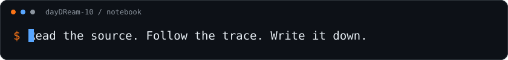
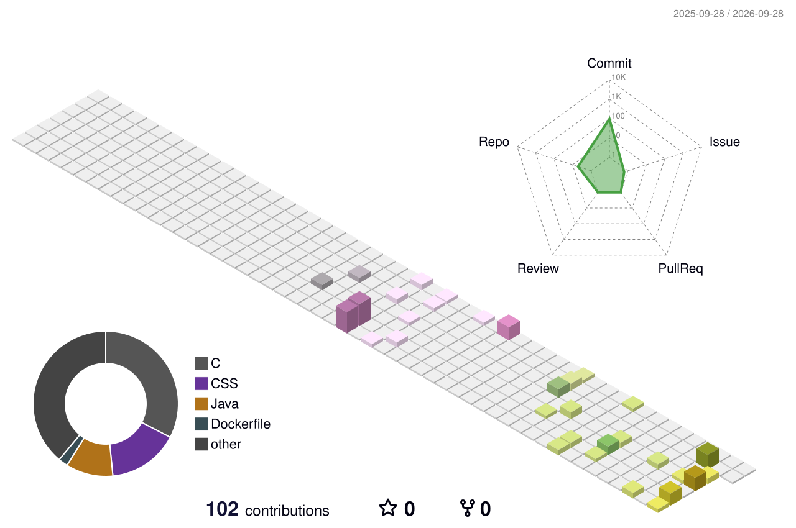

# ⚡ dayDReam-10

**CTF player · Reverse engineering · Pwn · Android internals**

> Read the source. Follow the trace. Write it down.

I'm a university student learning binary security, one program at a time. Most of my time goes into reverse engineering, Pwn challenges, and understanding what happens beneath an Android app.

I like following a question down to the source: how a binary is loaded, how an injection works, or why a check behaves the way it does. My notes are a record of that process — experiments, debugging sessions, and things I had to figure out twice.

## What I'm exploring

- **Reverse engineering:** native binaries, Android internals, and game engines.
- **Binary exploitation:** CTF challenges, Linux debugging, and reproducible Pwn environments.
- **Android research:** ELF loading, process injection, environment detection, and vulnerability analysis.
- **Building things:** Java, Python, and C++ projects that turn an idea into something usable.

## On my desk

| Area | Tools |
| --- | --- |
| Reverse engineering & debugging | IDA Pro, x32dbg, GDB |
| Environments | Linux, Docker |
| Languages | Java, Python, C++ |

## Projects & notes

| Project | What you'll find |
| --- | --- |
| [CTF](https://github.com/dayDReam-10/CTF) | RE/Pwn writeups, Android notes, and experiments with ELF loading and injection. |
| [pwn-docker-env](https://github.com/dayDReam-10/pwn-docker-env) | Docker configuration for a reproducible Pwn environment. |
| [StudioWork](https://github.com/dayDReam-10/StudioWork) | A university studio assessment project: a Java video-sharing and exhibition-ticket platform built with Servlet, JSP, JDBC, MySQL, Redis, WebSocket, and embedded Tomcat. |
| [Blog](https://github.com/dayDReam-10/Blog) | The source of my personal blog: technical notes, projects, and the occasional essay. |

## From the notebook

- [GhostLock: CVE-2026-43499](https://dr-blog.top/article.html?id=20260922) — Android kernel vulnerability analysis.
- [Unreal Engine 4 reverse engineering](https://dr-blog.top/article.html?id=20260923-ue4) — notes from an Android CTF challenge.
- [Environment detection & countermeasures](https://dr-blog.top/article.html?id=20260930-env-detection) — Frida, Root, Magisk, and KernelSU.
- [ELF format & loading](https://dr-blog.top/article.html?id=20261005-elf-basics) — following the path from file to process.

## A little activity

Generated daily with <a href="https://github.com/yoshi389111/github-profile-3d-contrib">github-profile-3d-contrib</a>.

---

[Blog ↗](https://dr-blog.top/) · [GitHub ↗](https://github.com/dayDReam-10)
